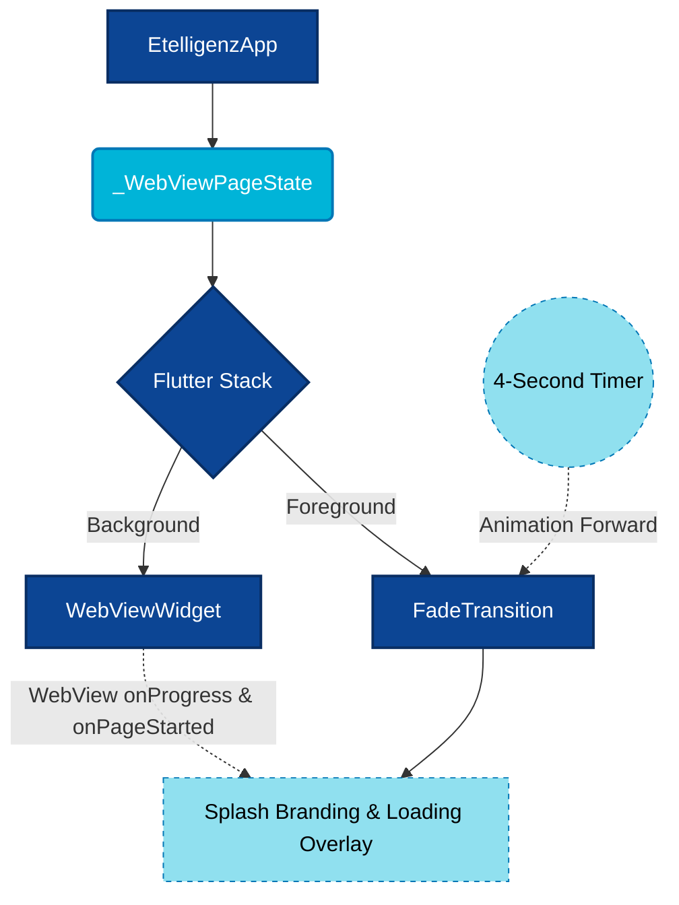

# Etelligenz WebView App

A modern, streamlined Flutter application designed to wrap the [Etelligenz](https://saveyourscraps.xyz/) dynamic web platform into a native mobile interface.

## 📱 Features & Highlights

- **Dynamic WebView Integration**: Fully responsive web mapping using the `webview_flutter` package, operating inside a `SafeArea` with unrestricted JavaScript enabled for full feature fidelity.
- **Custom Animated Splash Screen**: Overrides the standard generic device splash with a rich, GIF-animated (`assets/logo.gif`) splash screen that seamlessly delegates loading states.
- **Synchronized Loading Overlay**: Integrates a `LinearProgressIndicator` synchronized to the internal WebView `onProgress` callback. The overlay provides immediate feedback to the user on how fast the underlying web framework is loading.
- **Fade Transition Animation**: Instead of an abrupt view-pop, the application uses an `AnimationController` to execute a smooth 500ms `FadeTransition` from the splash overlay to the interactive web viewport.
- **Immersive Viewport**: Drops edge-blocks by painting a transparent status bar via `SystemChrome.setSystemUIOverlayStyle`. Dark icon brightness is used for optimized iOS/Android aesthetics.

## 🏗 System Architecture

The application is architected around a stateless top-level root (`EtelligenzApp`) defining the `MaterialApp` theme config and dispatching to a single-page stateful router (`_WebViewPageState`).



### Rendering Layers (`Stack`)
The core UI is built via a Flutter `Stack`:
1. **Background (Base)**: `WebViewWidget` which immediately evaluates and begins parsing the web DOM via `loadRequest(Uri.parse(...))`.
2. **Foreground (Overlay)**: A dynamically managed `FadeTransition` encompassing the splash visual, animated logo, and loading percentage text.

### State Interception
The `NavigationDelegate` intercepts native DOM lifecycle events:
- `onPageStarted` & `onProgress`: Directly mutate the state `_progress` value to reflect active network parsing via `setState`.
- `onNavigationRequest`: Enforces internal routing, ensuring the user stays within the web engine space natively.

Additionally, a concurrent `Future.delayed` 4-Second Timer runs synchronously against the rendering tree to guarantee the animated branding executes optimally before the foreground is dropped.

## 🛠 Project Structure

```text
com_etelligenz_flutter/
├── android/                   # Native Android wrapper and Gradle scripts
├── assets/                    # Static UI elements
│   ├── logo.gif               # Animated primary splash branding
│   └── logo.png               # Fallback branding
├── lib/                       # The primary Dart application code
│   └── main.dart              # Core routing, Splash State, and WebView configs
├── test/                      # Unit testing framework
│   └── widget_test.dart       # Smoke tests validating the Etelligenz widget tree
├── WSL_FLUTTER_SETUP.md       # Development environment guidelines
└── pubspec.yaml               # Dart dependencies and assets definition
```

## 🚀 Development & Setup

If you are developing this on Windows 11 with the WSL2 integration, strict environment configuration is extremely important to ensure networking bridging and dependency cache alignment.

**Check the [WSL Configuration Guide](./WSL_FLUTTER_SETUP.md) located in the root of the repository for full Android Emulator bridging setups.**
**Check the [Remote macOS iOS Setup Guide](./REMOTE_MACOS_IOS_SETUP.md) for instructions on compiling and simulating on iOS remotely from WSL.**

### Quick Start
1. Ensure the Flutter SDK is on your PATH.
2. Resolve dependencies:
   ```bash
   flutter pub get
   ```
3. Run the application (targeting your active emulator or physical device):
   ```bash
   flutter run
   ```

### Dependency Stack
- SDK Constraint: `^3.11.4`
- Core UI packages: `flutter`, `cupertino_icons`
- Web Engine: `webview_flutter` (`^4.13.1`)

---

## 🌍 Publication Guide: Next Steps for 100% Success

Follow this comprehensive standard operating procedure to successfully publish the Etelligenz application to the Google Play Store and Apple App Store.

### 🤖 Google Play Store (Android)

**1. Create a Keystore (Digital Signature)**
You must permanently digitally sign your Android build. Run the following command locally to generate a secure Keystore file:
```bash
keytool -genkey -v -keystore ~/upload-keystore.jks -keyalg RSA -keysize 2048 -validity 10000 -alias upload
```
*Never lose this file or the generated password, as losing it prevents releasing future updates.*

**2. Configure the Android `local.properties`**
Create a file named `android/key.properties` and add your Keystore credentials:
```properties
storePassword=<YOUR_STORE_PASSWORD>
keyPassword=<YOUR_KEY_PASSWORD>
keyAlias=upload
storeFile=/home/<USER>/upload-keystore.jks
```

**3. Inject Keystore into Gradle**
Open `android/app/build.gradle` and modify it to extract the `key.properties` variables and assign them to the `release` block inside `signingConfigs`.

**4. Build the AAB Compilation**
Google Play strictly requires Android App Bundles (AAB). Execute the command:
```bash
flutter build appbundle --release
```
Your final binary will be generated at `build/app/outputs/bundle/release/app-release.aab`.

**5. Publish via Google Play Console**
1. Register for a Google Play Developer account ($25 one-time fee).
2. Create your application inside the Play Console. Upload an app icon (512x512) and feature graphic (1024x500).
3. Draft a new release on the **Internal Testing Track** first to undergo automated pre-launch audits.
4. Fill out the **Data Safety form**, Content Rating questionnaire, and Privacy Policy URL.
5. Create a Production Release, upload your `.aab` file, and submit it for Apple/Google approval.

### 🍏 Apple App Store (iOS)

*Note: iOS publication strictly requires a Mac device or Virtual Machine running macOS and Xcode.*

**1. Create Apple Developer Certificates**
1. Apply and pay for the Apple Developer Program ($99/year).
2. Through the web portal, register a unique **App ID** (e.g., `com.etelligenz`).
3. Generate an iOS Distribution Certificate and a Provisioning Profile mapped to your App ID.

**2. Configure Xcode Metadata**
1. In Xcode, open the target location `ios/Runner.xcworkspace`.
2. Under the **Signing & Capabilities** tab, verify that your Apple Developer Account is authenticated and check "Automatically manage signing".
3. Update the General tab to include your specific Version (e.g., `1.0.0`) and Build Number (`1`).

**3. Build the Release IPA**
Inside your Flutter directory, execute:
```bash
flutter build ipa --release
```
This cleanly compiles the Swift/Objective-C frameworks and bundles the Dart AOT core.

**4. Publish via App Store Connect**
1. While still inside Xcode, navigate to `Product -> Archive`. Let the macOS architecture deeply compile the binaries.
2. The Xcode Organizer window will pop up automatically. Click **Distribute App**.
3. Go to the [App Store Connect web portal](https://appstoreconnect.apple.com/) and create a new iOS App target.
4. Upload all mandatory multi-resolution screenshots (specifically the required 6.5-inch and 5.5-inch displays).
5. Input your marketing text, privacy policy, and support URL.
6. Select the Build you pushed from Xcode Organizer and click **Submit for Review**. Wait 24–48 hours for Apple's success confirmation.

---
*Maintained by the Etelligenz Development Team.*
