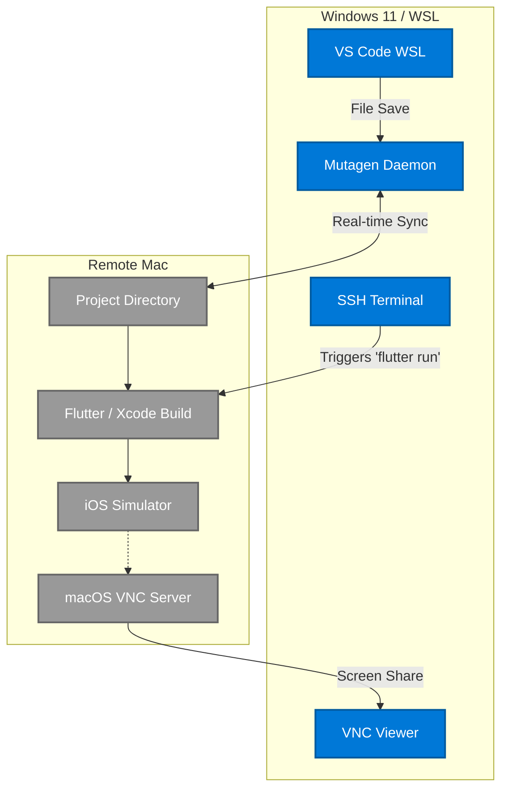

# Complete Remote iOS Development Setup (Windows 11 WSL -> Remote Mac)

Because Apple strictly locks the iOS SDK, Xcode, and the iOS Simulator directly to macOS architecture, you **cannot** run an iOS Simulator natively or pass it over a bridged socket to Windows like you can with the Android Emulator. 

To develop for iOS while fully maintaining your source-code and IDE environment on **Windows 11 via VS Code and WSL Ubuntu**, you must establish a continuous synchronization pipeline to a remote Mac.

This guide outlines the strictly verified, industry-standard approach for connecting a WSL Flutter project to a remote Mac for real-time compilation and emulation.

---

## 1. Core Prerequisites

### On Windows 11 / WSL
* Ensure your Windows 11 machine is running VS Code.
* Your primary Flutter project must be located in WSL Ubuntu (e.g., `~/projects/com_etelligenz_flutter`).
* You must have an SSH key generated in your WSL environment (`ssh-keygen -t ed25519`).

### On Remote Mac (Physical Mac or Cloud Mac)
* Install **Xcode** via the macOS App Store and run once to agree to license terms.
* Install the **Flutter SDK for macOS**.
* Enable Remote Login: Open `System Settings > General > Sharing` and turn on **Remote Login** (SSH). Add your WSL SSH public key to `~/.ssh/authorized_keys` on the Mac so you can securely connect without a password.
* Enable Screen Sharing: In the same Sharing menu, enable **Screen Sharing** (VNC).

---

## 2. Setting Up High-Performance Project Synchronization (Mutagen)

You cannot map a macOS network drive over SMB and compile over it; `xcodebuild` will fail or take excruciatingly long. The verified solution is to use **Mutagen**, an open-source tool that handles high-performance, real-time bidirectional syncing between WSL and macOS.



### Install Mutagen in WSL
1. Inside your WSL Ubuntu terminal, install Mutagen:
   ```bash
   brew install mutagen-io/mutagen/mutagen
   # Alternatively: curl -sLo- https://mutagen.io/download/update | bash
   ```
2. Start the Mutagen background daemon:
   ```bash
   mutagen daemon start
   ```

### Establish the Sync Session
Create an empty directory on your remote Mac (e.g., `~/Developer/com_etelligenz_flutter`). Then from WSL, execute the sync command:

```bash
# General syntax: mutagen sync create <local_path> <remote_path>
mutagen sync create \
    ~/projects/com_etelligenz_flutter \
    <mac_username>@<mac_ip_address>:~/Developer/com_etelligenz_flutter \
    --ignore-vcs --ignore="build" --ignore=".dart_tool"
```

*Crucial Step: We ignore the `build` and `.dart_tool` folders because the caching architecture for Linux (WSL) and macOS (Xcode) directly conflict. Ignoring these ensures the Mac compiles cleanly using its own Apple infrastructure.*

---

## 3. Remote Compilation and Simulator Execution

With Mutagen running, the moment you press `Ctrl+S` on any Dart file in your Windows VS Code, it is instantly loaded onto the Mac's solid-state drive.

1. **Connect to the Console:** Open a dedicated VS Code terminal in Windows and SSH into the Mac:
   ```bash
   ssh <mac_username>@<mac_ip_address>
   ```
2. **Navigate to the Project:**
   ```bash
   cd ~/Developer/com_etelligenz_flutter
   ```
3. **Launch the iOS Simulator via CLI:**
   You must open the simulator *before* calling flutter.
   ```bash
   open -a Simulator
   ```
4. **Compile and Run:**
   ```bash
   flutter run -d simulator
   ```
   *Note: Because you excluded `.dart_tool` and `build` from the Mutagen sync, this will construct the iOS build profile specific to the Apple M-series or Intel chip.*

---

## 4. Viewing the iOS Simulator on Windows 11

To interact with the iOS Simulator executing in the Mac's GUI memory, you will use a VNC (Virtual Network Computing) client on your Windows 11 host.

1. Download a Verified VNC Viewer on Windows (e.g., **RealVNC Viewer** or **TightVNC**).
2. Connect the VNC viewer to your Mac's IP Address (e.g., `192.168.1.50`).
3. Log in with your Mac credentials.
4. You will now see the macOS Desktop running the iOS Simulator in a window on your Windows 11 display. 

### Development Workflow Loop:
1. Edit your `lib/main.dart` code inside VS Code on Windows (WSL).
2. Hit `Save`. Mutagen immediately synchronizes this to the Mac in less than 50ms.
3. Bring focus to your SSH terminal (connected to the Mac) and press `r` to execute Flutter's Hot Reload.
4. Watch the updates instantly paint onto the iOS Simulator through your VNC Viewer.

---

## 5. Alternative Approach (VS Code Remote-SSH)

If Mutagen synchronization via WSL proves too deeply nested for your workflow, the alternative industry standard is to circumvent WSL entirely for iOS:
1. Clone the repository strictly onto the Remote Mac.
2. Ensure you have the **Remote - SSH** extension installed in VS Code on Windows 11.
3. Use VS Code to connect directly to the Mac and edit/run the codebase located there, treating the Mac as the ultimate source of truth, rather than syncing to Linux.
