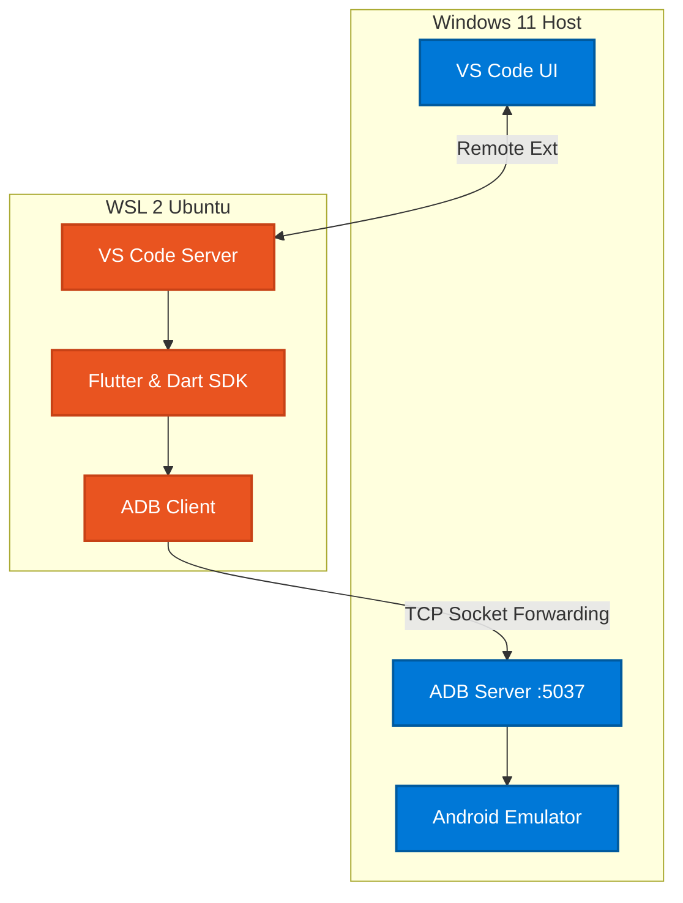

# Full Development Setup: Flutter on WSL2 with Windows 11 & Android Emulator

This guide provides a verified, step-by-step procedure to set up a robust Flutter development environment using Windows 11, WSL2 (Ubuntu), Visual Studio Code, and the Android Emulator. It bridges the Android Emulator running on the Windows host to the Flutter framework running securely inside the Linux subsystem, ensuring maximum performance and compatibility without path-resolution errors.

## 1. Prerequisites (Windows 11 Host)

*   **Install WSL2 & Ubuntu:** Open Windows PowerShell as Administrator and run `wsl --install`. Ensure you choose a distribution like Ubuntu.
*   **Install Android Studio:** Download and install Android Studio on Windows.
    *   Open Android Studio -> SDK Manager. Install the latest Android SDK and Command-line Tools.
    *   Open Virtual Device Manager (AVD) and create/launch an Android Emulator.
*   **Install Visual Studio Code:** Download and install VS Code for Windows. Ensure the "Add to PATH" option is checked during installation.

## 2. VS Code System Setup & Plugins

To cleanly bridge the UI (Windows) and the backend (Linux), VS Code uses Remote Development.

1.  Open VS Code on Windows.
2.  Navigate to the **Extensions** view (`Ctrl+Shift+X`).
3.  Search for and install the **WSL extension** (Publisher: Microsoft). This acts as the bridge.

## 3. WSL2 (Ubuntu) SDK Installation

Your core dependencies must live *inside* Linux for Flutter to compile optimally. 

1. Open your Ubuntu WSL terminal.
2. **Install Flutter SDK for Linux:**
   ```bash
   git clone https://github.com/flutter/flutter.git -b stable ~/flutter
   export PATH="$PATH:~/flutter/bin"
   ```
3. **Install Android Command Line Tools for Linux (Optional but Recommended):**
   Download the Linux Android SDK tools, or set up Android SDK internally in Linux. Based on our environment configuration, map the internal paths:
   * **Linux Android SDK Location:** `/home/$USER/Android/Sdk`
   * **Linux Flutter SDK Location:** `/home/$USER/flutter`

## 4. Bridging the Android Emulator (Windows -> WSL)

This is the most critical step. Since the Android Emulator runs on Windows (for hardware acceleration) but Flutter runs on Linux, we must bridge the Android Debug Bridge (ADB).



**Step A: Expose Windows ADB**
1. On Windows PowerShell, start the ADB server to listen on all interfaces:
   ```powershell
   adb kill-server
   adb -a -P 5037 nodaemon server
   ```
   *(Keep this terminal open, or configure Windows to run it silently)*

**Step B: Connect WSL to Windows ADB**
1. In your WSL terminal, find your Windows Host IP address:
   ```bash
   cat /etc/resolv.conf | grep nameserver | cut -d' ' -f2
   ```
2. Export the `ADB_SERVER_SOCKET` variable to point to that IP. Add this to your `~/.bashrc`:
   ```bash
   export ADB_SERVER_SOCKET=tcp:<YOUR_WINDOWS_IP>:5037
   ```
3. Reload your terminal (`source ~/.bashrc`) and run `flutter devices`. You should now successfully see the Windows Android Emulator listed inside WSL!

## 5. Connecting VS Code to your Flutter Project

1. In your WSL terminal, navigate to your Flutter project directory:
   ```bash
   cd ~/projects/com_etelligenz_flutter
   code .
   ```
   *(This launches the Windows VS Code UI securely hooked into the Linux filesystem)*
2. In VS Code, open the **Extensions** view again.
3. You will see a section titled **WSL: Ubuntu - Installed**.
4. Search for and install the **Flutter** and **Dart** extensions *specifically inside the WSL environment*.

## 6. Known Gotchas & Troubleshooting (Verified from this Session)

During compilation, Gradle caches can accidentally fetch Windows (`C:/Users/...`) paths if previously initialized on Windows. If Android Studio complains about "Included build does not exist" or "Errored setting resolving plugin":

1. **Hardcode the safe path:** Open `android/settings.gradle.kts`. Instead of dynamically resolving `local.properties` (which might pull stale cache data), securely hardcode the Linux SDK:
   ```kotlin
   // Inside pluginManagement { ... }
   val flutterSdkPath = "/home/$USER/flutter" 
   ```
2. **Define Local Properties securely:** Verify `android/local.properties` contains absolute Linux paths:
   ```properties
   sdk.dir=/home/username/Android/Sdk
   flutter.sdk=/home/username/flutter
   ```
3. **Nuke the IDE Cache:** If the IDE (Language Server) refuses to drop the error:
   * Close the project.
   * Run `rm -rf android/.gradle android/.idea`
   * Run `flutter clean && flutter pub get`
   * Reopen VS Code. This forces the Kotlin Script daemon to execute cleanly without Windows contamination.

## 7. Compile and Run

From the VS Code internal terminal (which is running the WSL bash instance):
```bash
flutter run
```
Because ADB is correctly bridged, your compiled APK will automatically be transmitted through the TCP socket and booted onto the Windows 11 Android Emulator.
